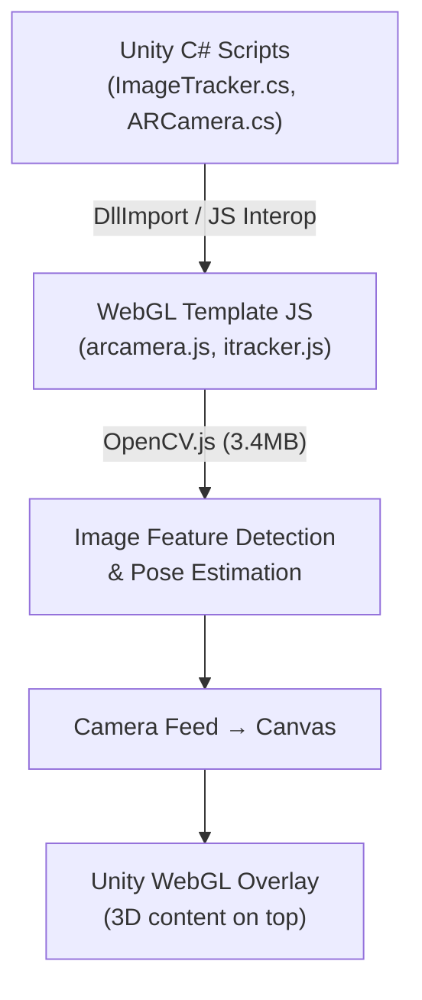
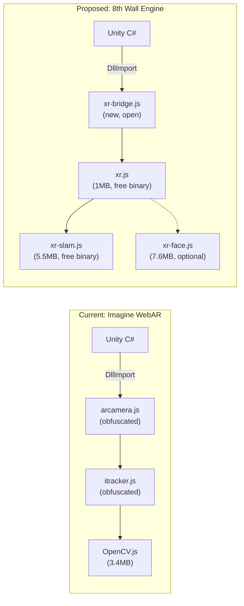

# Unity AR Template + 8th Wall Engine — Integration Analysis

## What You Have

### Unity "Imagine WebAR Image Tracker" Template
Your Unity project uses the **Imagine WebAR** addon (from the Unity Asset Store) to do image tracking in WebGL builds. Here's how it works:

| Component | Tech | Size | Open Source? |
|-----------|------|------|-------------|
| Image tracking | `itracker.js` (obfuscated) + OpenCV.js | ~3.5MB + 90KB | ❌ Obfuscated/proprietary |
| Camera handling | `arcamera.js` (obfuscated) | 15KB | ❌ Obfuscated/proprietary |
| Unity bridge | `ImageTracker.cs`, `ARCamera.cs` | — | ✅ Your code |
| 3D rendering | Unity WebGL | — | ✅ Unity engine |

### PlayCanvas "AR Gallery" Template (existing in your repo)
You also already have a separate **PlayCanvas + 8th Wall** project in `ar-gallery-template/` that does the same thing (image target → video overlay) but uses the self-hosted 8th Wall engine.

---

## What 8th Wall's Open-Sourced Engine Offers

As of Feb 28, 2026, the 8th Wall platform was retired and the engine components were distributed:

| Component | License | Relevance to Your Project |
|-----------|---------|--------------------------|
| **Image Targets** | ✅ Open source (MIT) | **Direct replacement** for Imagine's `itracker.js` |
| **Face Effects** | ✅ Open source (MIT) | 🆕 New capability (not in your template) |
| **Sky Effects** | ✅ Open source (MIT) | 🆕 New capability (segmentation) |
| **XR Engine Core** (SLAM/World Tracking) | ⚠️ Free binary, **closed source** (limited-use license) | Enhancement for world-anchored content |
| **Image Target CLI** | ✅ Open source | Replaces 8th Wall's cloud dashboard for target processing |
| **PlayCanvas/Three.js/A-Frame modules** | ✅ Open source | Not directly useful for Unity |

---

## Can 8th Wall Enhance Your Unity Template?

### Short answer: **Yes, but with significant caveats.** 

### What's feasible

#### 1. ✅ Replace `itracker.js` + OpenCV.js with 8th Wall's Image Target system
- **Why**: 8th Wall's image tracking is **battle-tested** and likely more performant than the OpenCV.js-based approach in Imagine WebAR. The XR8 engine's SLAM-based image tracking provides better stability, occlusion handling, and pose estimation.
- **How**: You would replace the WebGL template's `itracker.js` + `opencv.js` with `xr.js` + `xr-slam.js` from the 8th Wall engine binary, then rewrite the JS interop layer.
- **Savings**: ~3.5MB (dropping OpenCV.js) vs ~6.5MB (adding xr.js + xr-slam.js). Net size increase, but much better tracking quality.

#### 2. ✅ Add Face Effects (face filters, face tracking)
- **Why**: The open-source `xr-face.js` (~7.6MB) includes face mesh, iris tracking, and ear detection models. Your Imagine WebAR addon doesn't have this at all.
- **How**: Add a new `FaceTracker.cs` script in Unity with JS interop to the face pipeline. Load `xr-face.js` alongside `xr.js`.

#### 3. ✅ Add Sky Effects
- **Why**: Sky segmentation for AR sky replacement, ground augmentation, etc.
- **How**: Similar interop approach — the semantics worker and model are already in your `lib/resources/`.

#### 4. ⚠️ Add World Tracking (SLAM)
- **Why**: Place 3D objects in the real world, not just on image targets.
- **Caveat**: The SLAM engine is **closed-source binary**, free to use but under a limited-use distribution license. Your template would depend on a non-open-source component.

### What's NOT directly feasible

#### ❌ Using 8th Wall's PlayCanvas/Three.js/A-Frame pipeline modules in Unity
The open-source 8th Wall framework modules (`XR8.PlayCanvas.pipelineModule()`, `XR8.Threejs.pipelineModule()`, etc.) are designed for those specific 3D engines. They manage cameras, scenes, and rendering for PlayCanvas/Three.js. Unity WebGL has its own rendering pipeline, so these don't apply.

#### ❌ Dropping Unity entirely in favor of 8th Wall
Your Unity template gives you the full Unity editor, URP shader pipeline, physics, animation, and C# scripting. 8th Wall's open-source engine doesn't replace any of that — it only provides the AR tracking layer.

---

## Architecture Comparison

---

## Recommendation

| Approach | Effort | Benefit |
|----------|--------|---------|
| **A. Keep using Imagine WebAR** | None | Works now; limited to image tracking only |
| **B. Replace image tracking with 8th Wall engine** | Medium (~2 days) | Better tracking quality, self-hosted, no obfuscated code dependency |
| **C. Hybrid: Keep Imagine for image tracking, add 8th Wall for face/sky effects** | Medium-High (~3 days) | Best of both worlds, but two AR engines = larger bundle |
| **D. Full migration to 8th Wall engine** | High (~1 week) | Full AR stack (image + world + face + sky), single engine, bigger bundle |

> [!IMPORTANT]
> The core challenge with any integration is **writing the JS interop bridge** between Unity's WebGL build and the XR8 engine. Your Imagine WebAR addon already does this (via obfuscated `arcamera.js`), so you'd essentially be building a new, transparent version of that bridge for 8th Wall's API.

> [!TIP]
> If your main goal is **gallery art tracking → video overlay**, your existing setup works fine. The 8th Wall engine becomes compelling if you want to add **face filters, sky effects, or world-anchored content** to the experience — things Imagine WebAR simply can't do.

## Next Steps (If You Want to Proceed)

1. **Decide which approach (A–D)** fits your goals
2. If B or D: I can build a new `xr-bridge.js` (transparent, open) that replaces `arcamera.js` and wires XR8's image tracking events into Unity via `SendMessage()`
3. If C: I can add face/sky as separate modules alongside the existing Imagine setup
4. Regardless: Consider whether your **PlayCanvas template** (`ar-gallery-template/`) already meets the need — it's already using 8th Wall and doesn't require the Unity-to-WebGL overhead
