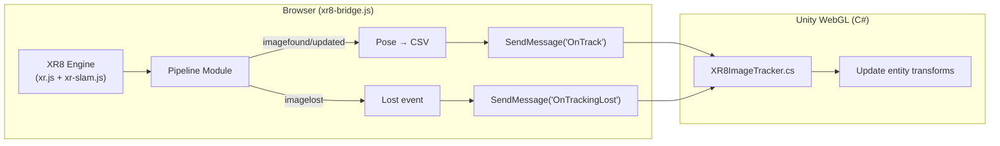

# Fork Unity AR Template: Imagine WebAR → 8th Wall Engine

Replace the closed-source Imagine WebAR addon with a **from-scratch Unity Package** built on 8th Wall's self-hosted engine. Structured as a reusable UPM addon.

## User Review Required

> [!IMPORTANT]
> **Same deployment workflow**: Build WebGL in Unity → upload to any host → done. No cloud, no app keys.

> [!WARNING]  
> **I can create all files but cannot run the Unity Editor build.** You'll need to:
> 1. Open the project in Unity 6
> 2. Set WebGL template to `8thWallTracker`
> 3. Build & Run → upload to your host

> [!IMPORTANT]
> **Image targets**: With 8th Wall, you process images via `@8thwall/image-target-cli` (Node.js CLI) → outputs JSON + luminance image. I'll include a guide and sample data.

---

## Proposed Changes

### Addon Structure: `XR8WebAR/`

Structured as a **Unity Package** (`com.hoodtronik.xr8-webar`) installable via UPM:

```
Ar-Image-Template-8thWall/
├── Assets/
│   ├── XR8WebAR/                          ← The addon (UPM-ready)
│   │   ├── package.json                   ← UPM manifest
│   │   ├── Runtime/
│   │   │   ├── XR8WebAR.Runtime.asmdef    ← Assembly definition
│   │   │   ├── Scripts/
│   │   │   │   ├── XR8Camera.cs           ← Camera bridge (replaces ARCamera.cs)
│   │   │   │   ├── XR8ImageTracker.cs     ← Image tracker (replaces ImageTracker.cs)
│   │   │   │   └── XR8TrackerSettings.cs  ← Tracker settings
│   │   │   └── Plugins/
│   │   │       ├── XR8CameraLib.jslib     ← JS interop for camera
│   │   │       ├── XR8TrackerLib.jslib    ← JS interop for tracker
│   │   │       ├── TransparentBackground.jslib  ← glClear override
│   │   │       ├── Helpers.jslib          ← Screenshots/URL helpers
│   │   │       └── DownloadTexture.jslib  ← Texture download
│   │   └── WebGLTemplate~/               ← Copy to Assets/WebGLTemplates/
│   │       └── 8thWallTracker/
│   │           ├── index.html             ← WebGL entry point
│   │           ├── xr8-bridge.js          ← Open-source XR8↔Unity bridge
│   │           ├── xr.js                  ← 8th Wall engine (binary)
│   │           ├── xr-slam.js             ← SLAM chunk (binary)
│   │           └── TemplateData/
│   ├── Scenes/
│   │   └── SampleScene.unity              ← Demo scene using XR8WebAR
│   └── image-targets/                     ← Sample target data
│       ├── gallery-target.json
│       └── gallery-target_luminance.jpg
└── README.md
```

---

### WebGL Template

#### [NEW] index.html
Loads XR8 engine, starts AR on user tap, wires camera feed to Unity canvas.

#### [NEW] xr8-bridge.js
**The core bridge** — transparent, readable, 100% original. Two classes:

**`XR8CameraBridge`** — manages:
- Webcam start/stop/pause via XR8
- Video texture pointer sharing with Unity (same WebGL texture approach)
- FOV computation and orientation change detection
- Camera flip (front/back)

**`XR8TrackerBridge`** — manages:
- XR8 pipeline module registration for image target events
- Converting XR8 pose data to the same CSV format Unity expects:
  ```
  id, posX, posY, posZ, fwdX, fwdY, fwdZ, upX, upY, upZ, rightX, rightY, rightZ
  ```
- Calling `unityInstance.SendMessage('XR8ImageTracker', 'OnTrack', csvData)` etc.



---

### C# Scripts

#### [NEW] XR8Camera.cs
Replaces `ARCamera.cs`. Same concepts — attaches to Camera, manages video background, FOV updates, orientation events, pause/unpause.

#### [NEW] XR8ImageTracker.cs
Replaces `ImageTracker.cs`. Same callback pattern (`OnTrack`, `OnTrackingFound`, `OnTrackingLost`), same CSV parsing, same `CAMERA_ORIGIN`/`FIRST_TARGET_ORIGIN` modes, same smoothing.

#### [NEW] XR8TrackerSettings.cs
Simplified config — 8th Wall handles most tuning internally.

---

### .jslib Plugin Files

#### [NEW] XR8CameraLib.jslib
`WebGLStartXR8()`, `WebGLStopXR8()`, `WebGLPauseCamera()`, `WebGLUnpauseCamera()`, `WebGLGetVideoDims()`, `WebGLSubscribeVideoTexturePtr()`, `WebGLGetCameraFov()`

#### [NEW] XR8TrackerLib.jslib
`StartXR8ImageTracker()`, `StopXR8ImageTracker()`, `IsXR8TrackerReady()`, `SetXR8TrackerSettings()`

#### [KEEP] TransparentBackground.jslib, Helpers.jslib, DownloadTexture.jslib
These are generic utilities — kept as-is.

---

## Verification Plan

### Manual Verification (User)
1. Open `Ar-Image-Template-8thWall/` in Unity 6 → verify no compile errors
2. Set WebGL template to `8thWallTracker` in Project Settings
3. Build WebGL → serve over HTTPS
4. Test on phone: point at sample target → verify overlay tracks correctly
5. Compare tracking quality with original Imagine WebAR template
